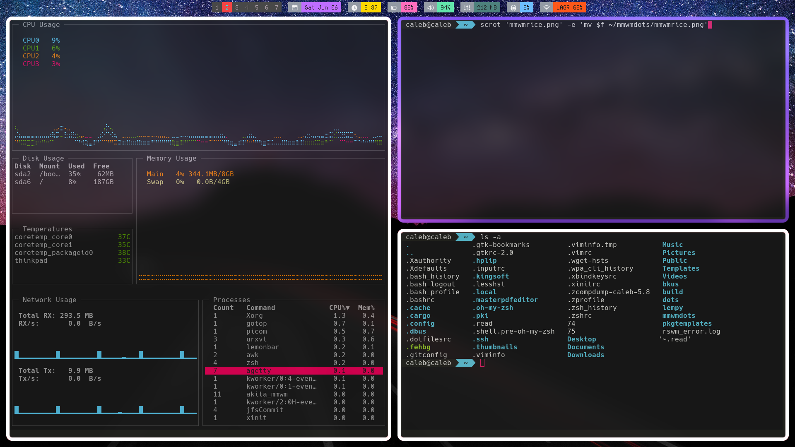

# mmWM Rice
#### basic working Modern Minimalistic Window Manager setup

The configuration includes the most basic additions for any wm setup

- brightness keys via xbacklight
- volume keys via alsa
- mod4+r for rofi

Some features were merged back in from FrankenWM

- mod4+j/k for moving between windows

Thanks
------

[MMWM by kagum](https://github.com/kaugm/mmwm)

